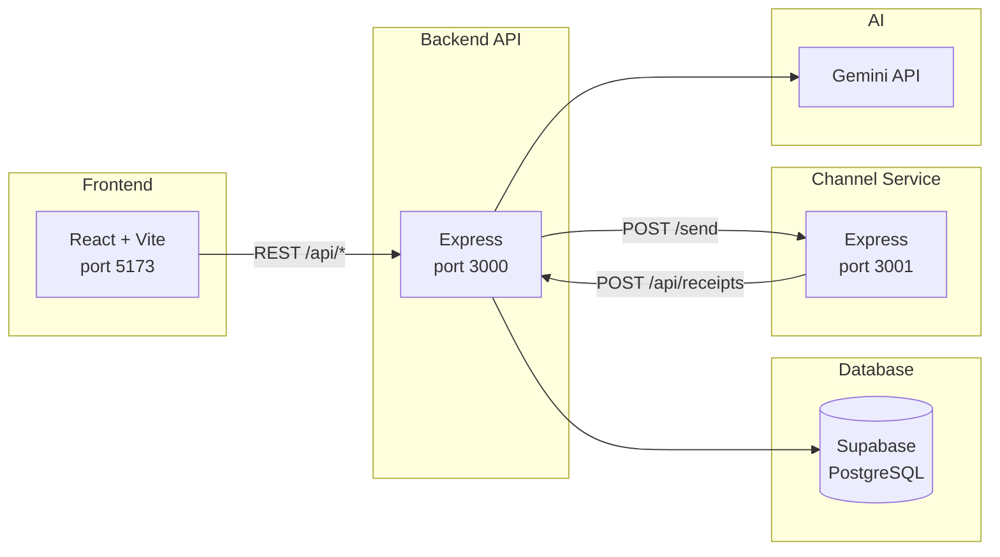

# Aura — AI-Native Mini CRM

## What I Built

Aura is a full-stack CRM for D2C brands in India. Marketers can import customers, build segments (manually or with AI), launch multi-channel campaigns (WhatsApp, SMS, Email, RCS), and watch delivery funnels update in real time. An AI assistant panel helps with targeting ideas, message drafts, and performance questions — with one-click actions to create segments or start campaigns.

The system is designed as a realistic mini production stack: a React frontend, Express API backed by Supabase (PostgreSQL), a separate channel microservice that simulates message delivery with retries and callbacks, and Gemini (`gemini-2.5-flash`) powering segmentation, copy generation, and the conversational assistant.

## Architecture



## Key Technical Decisions & Tradeoffs

- **Decision:** Monolithic Express backend + separate channel service | **Why:** Keeps CRM logic in one deployable unit while isolating delivery simulation and backoff/retry | **Tradeoff:** More moving parts locally; true production would add a message queue between API and senders
- **Decision:** Supabase with service-role key on the backend | **Why:** Fast Postgres setup, migrations, and RLS-ready schema without building auth in the demo | **Tradeoff:** Backend bypasses RLS; production needs Supabase Auth + tighter policies
- **Decision:** Forward-only communication status + debounced stats recalculation | **Why:** Prevents out-of-order webhook callbacks from corrupting funnel metrics during large launches | **Tradeoff:** Stats reflect cumulative funnel stages, not simultaneous status snapshots
- **Decision:** Polling (3s) for live campaign dashboard | **Why:** Zero infrastructure beyond HTTP; works through Vite proxy immediately | **Tradeoff:** Higher request volume than WebSockets/SSE at scale
- **Decision:** Gemini called directly from route handlers | **Why:** Minimal latency and code paths for segment suggest, message gen, and chat | **Tradeoff:** No central rate-limiting, caching, or prompt versioning layer

## AI-Native Workflow

**In the product:** Gemini powers three features — natural-language segment rule extraction (`POST /api/segments/ai-suggest`), channel-aware campaign copy (`POST /api/campaigns/:id/generate-message`), and the floating AI assistant (`POST /api/chat`) with multi-turn memory and actionable `<action />` tags for creating segments or campaigns.

**To build the product:** Gemini was used to scaffold routes, design the delivery simulation pipeline, draft system prompts for Indian D2C context, and iterate on frontend UX (live funnel charts, assistant panel, campaign detail polling). The codebase treats AI as a first-class integration — not a bolt-on — with shared prompts, JSON parsing utilities, and explicit response contracts for the frontend.

## Setup

### Prerequisites

- Node.js 18+
- Supabase project (run migrations in `supabase/migrations/`)
- Google Gemini API key

### 1. Clone and install

```bash
# Frontend (project root)
npm install

# Backend
cd backend && npm install

# Channel service
cd ../channel-service && npm install
```

### 2. Environment variables

Copy examples and fill in values:

```bash
cp backend/.env.example backend/.env
cp channel-service/.env.example channel-service/.env
```

**Backend (`backend/.env`)** — required:

| Variable | Description |
|----------|-------------|
| `SUPABASE_URL` | Supabase project URL |
| `SUPABASE_SERVICE_ROLE_KEY` | Service role key (server only) |
| `GEMINI_API_KEY` | Google Gemini API key |
| `PORT` | Optional, default `3000` |
| `CHANNEL_SERVICE_URL` | Optional, default `http://localhost:3001` |

**Channel service (`channel-service/.env`)** — optional:

| Variable | Description |
|----------|-------------|
| `CRM_BACKEND_URL` | Default `http://localhost:3000` |
| `PORT` | Default `3001` |

### 3. Database migrations

Apply SQL files in `supabase/migrations/` to your Supabase project (SQL editor or CLI).

### 4. Seed sample data

```bash
cd backend
npm run seed
# or: npx ts-node --esm src/seed.ts
```

Idempotent — skips if customers already exist. Inserts 200 customers, 800 orders, and 4 pre-built segments.

### 5. Run locally

```bash
# Terminal 1 — backend
cd backend && npm run dev

# Terminal 2 — channel service
cd channel-service && npm run dev

# Terminal 3 — frontend
npm run dev
```

Frontend: http://localhost:5173 (proxies `/api` → backend)

Health checks:

- Backend: `GET http://localhost:3000/health`
- Channel: `GET http://localhost:3001/health`

## Deployment

| Service | URL |
|---------|-----|
| Frontend | `https://aura.vercel.app` (update after deploy) |
| Backend API | `https://aura-api.railway.app` (update after deploy) |
| Channel service | `https://aura-channel.railway.app` (update after deploy) |

## Quick Smoke Test

1. Dashboard → Generate Sample Data → verify 200 customers appear
2. Segments → verify 4 pre-built segments loaded
3. New Segment → AI-Assisted mode → type a description → verify name and rules auto-populate
4. Campaigns → New Campaign → pick segment → pick WhatsApp → Generate with AI → verify message appears
5. Complete 3-step flow → Launch
6. Campaign Detail → verify Live badge appears and stats update every 3 seconds
7. Confirm campaign reaches Completed status and polling stops
8. AI Assistant panel → ask "How did my last campaign perform?" → verify real data in response

## What I'd Do at Scale (10M customers)

- **Partition and index aggressively** — shard `communications` and `orders` by `campaign_id` / time; move segment matching to precomputed materialized views or ClickHouse for analytics instead of live JSONB filters on every launch.
- **Async campaign pipeline** — replace in-process batch dispatch with SQS/Kafka + worker pool; channel service becomes a consumer fleet with idempotent receipt IDs.
- **Real-time fan-out** — replace polling with Supabase Realtime or Redis pub/sub for campaign stats; edge-cache segment counts updated incrementally on order ingest.

## Project Structure

```
├── src/                 # React frontend
├── backend/             # Express API
├── channel-service/     # Delivery simulator
└── supabase/            # SQL migrations
```

## API Overview

| Area | Endpoints |
|------|-----------|
| Customers | `POST /bulk`, `GET /`, `GET /:id` |
| Orders | `POST /bulk`, `GET /` |
| Segments | `POST /`, `GET /`, `POST /ai-suggest`, `GET /:id/customers`, `DELETE /:id` |
| Campaigns | CRUD, `POST /:id/launch`, `POST /:id/generate-message`, `GET /:id/stats`, `GET /:id/communications` |
| Chat | `POST /api/chat` |
| Receipts | `POST /api/receipts` (channel callbacks) |
| Seed | `POST /api/seed/generate` |
